# 1. PyTorch Lightning

*This blog post provides an extensive tutorial of practical implementation of PyTorch Lightning for a real-world multi-class classification problem focused on product packaging categorization. The showcase walks through building a complete deep learning pipeline for tabular data, from data preparation to model deployment. While the code examples use a specific packaging classification dataset, the implementations are designed to be reusable for any tabular multi-class classification task. The tutorial serves both as a learning resource for PyTorch Lightning fundamentals and as a template for similar business applications.*

Find the full code in the repository [pytorch-lightning-tabular-classification](https://github.com/tiefenthaler/pytorch-lightning-tabular-classification) on GitHub.

## 1.1. Table of Contents

**Section 1 and 2 provide a brief overview of PyTorch Lightning.**  
**Section 3 describes the use case of tabular multi-class classification.**  
**Section 4 provides the code implementation of the deep learning pipeline.**  

- [1. PyTorch Lightning](#1-pytorch-lightning)
  - [1.1. Table of Contents](#11-table-of-contents)
- [2. PyTorch Lightning Overview](#2-pytorch-lightning-overview)
- [3. Key Features of PyTorch Lightning](#3-key-features-of-pytorch-lightning)
  - [3.1. Datasets, DataLoaders, LightningDataModule, LightningModule and LightningTrainer - Core API Features (Version: Lightning.PyTorch \> 2.0)](#31-datasets-dataloaders-lightningdatamodule-lightningmodule-and-lightningtrainer---core-api-features-version-lightningpytorch--20)
- [4. Tabular Multi-Class Classification Use Case](#4-tabular-multi-class-classification-use-case)
- [5. Building our Deep Learning Pipeline](#5-building-our-deep-learning-pipeline)
  - [5.1. Datasets, DataLoaders, LightningDataModule for Tabular Data](#51-datasets-dataloaders-lightningdatamodule-for-tabular-data)
    - [5.1.1. Dataset for Tabular Data (Code Implementation)](#511-dataset-for-tabular-data-code-implementation)
    - [5.1.2. LightningDataModule (Code Implementation)](#512-lightningdatamodule-code-implementation)
    - [5.1.3. Instantiation of TabularDataModuleClassificationPACKAGING with our use case data (Code Implementation)](#513-instantiation-of-tabulardatamoduleclassificationpackaging-with-our-use-case-data-code-implementation)
  - [5.2. LightningModule \& LightningTrainer for Tabular Data](#52-lightningmodule--lightningtrainer-for-tabular-data)
    - [5.2.1. LightningModule (Code Implementation)](#521-lightningmodule-code-implementation)
    - [5.2.2. Multi-Layer-Perceptron (MLP) Model Definition (Code Implementation)](#522-multi-layer-perceptron-mlp-model-definition-code-implementation)
    - [5.2.3. MLP with Categorical Feature Embeddings Model Definition (Code Implementation)](#523-mlp-with-categorical-feature-embeddings-model-definition-code-implementation)
    - [5.2.4. Instantiation of MLP Model and MulticlassTabularLightningModule (Code Implementation)](#524-instantiation-of-mlp-model-and-multiclasstabularlightningmodule-code-implementation)
    - [5.2.5. Training \& Evaluation with LightningTrainer (Code Implementation)](#525-training--evaluation-with-lightningtrainer-code-implementation)
- [6. Summary](#6-summary)
- [7. Code structure](#7-code-structure)

# 2. PyTorch Lightning Overview

**PyTorch Lightning** is a high-level, open-source framework built on top of **PyTorch** that simplifies the process of training and deploying deep learning models. Its primary goal is to provide a clear, organized, and more scalable way to develop machine learning models, without sacrificing the flexibility and power of PyTorch itself.

PyTorch Lightning abstracts away much of the boilerplate code involved in model training, such as managing the training loop, logging, and handling device placement, allowing researchers and developers to focus more on the architecture and experimentation aspects of their models.

**When to Use PyTorch Lightning?**

- **For large, complex projects**: If you're building deep learning models that require scalability, mixed precision, or distributed training.
- **For quick iteration and research**: It helps streamline the research process, making it easier to test different ideas and manage large models.
- **For developers new to PyTorch**: Lightning reduces the amount of boilerplate code and makes PyTorch more approachable, especially for those who are not deeply familiar with all of its intricacies.
- **For teams**: When multiple people need to collaborate on the same codebase or experiment, PyTorch Lightning can help maintain cleaner code and standardize practices.

# 3. Key Features of PyTorch Lightning

1. **Cleaner Code Structure**:
    - Lightning abstracts away the common parts of the training loop (e.g., the forward pass, loss computation, optimizer steps, etc.) while still keeping the flexibility to modify any part of the process.
    - This results in cleaner, modular, and more maintainable code.
2. **Automatic Optimization**:
    - PyTorch Lightning automatically handles many details of training, such as gradient accumulation, distributed training, and mixed precision.
    - It offers built-in methods for dealing with optimizers and schedulers, reducing the boilerplate code.
3. **Distributed Training**:
    - Supports **multi-GPU** and **multi-node** training seamlessly. Lightning provides methods for scaling models across multiple devices without requiring major changes to the codebase.
    - It can run on various distributed computing setups, including **DataParallel**, **DistributedDataParallel (DDP)**, and **Horovod**.
4. **Callbacks & Logging**:
    - Lightning integrates with several logging frameworks such as **TensorBoard**, **Weights & Biases**, and **MLflow** out-of-the-box.
    - It provides customizable **callbacks** for events like model checkpoints, early stopping, and monitoring metrics during training.
5. **Model Checkpoints & Recovery**:
    - Automatically saves models at checkpoints during training, which makes it easier to resume training from a specific point or select the best model based on validation performance.
6. **Mixed Precision Training**:
    - Enables **automatic mixed precision (AMP)**, which improves training efficiency by using lower-precision (float16) arithmetic on GPUs. This reduces memory consumption and speeds up computation without sacrificing model accuracy.
7. **TPU & GPU Support**:
    - Native support for **TPU** and **GPU** accelerators.
    - Easily scale your models to run on these hardware devices with minimal configuration.
8. **Extensible & Customizable**:
    - While PyTorch Lightning handles much of the boilerplate code, it still allows for full customization when needed. You can define custom training loops, optimizers, and learning rate schedules.
9. **Data Integration**:
    - Works seamlessly with popular data processing libraries like **PyTorch DataLoader** and integrates easily with datasets.
    - PyTorch Lightning provides the ability to easily extend data loaders and preprocessors as needed.
10. **Ecosystem Support**:
    - Lightning integrates with other parts of the PyTorch ecosystem, such as **TorchMetrics** for metrics computation, **TorchServe** for model serving, and **PyTorch Lightning Flash** for simplifying common tasks like text classification, image recognition, and more.

## 3.1. Datasets, DataLoaders, LightningDataModule, LightningModule and LightningTrainer - Core API Features (Version: Lightning.PyTorch > 2.0)

In PyTorch Lightning, **Datasets**, **DataLoaders**, and **LightningDataModules** play key roles in efficiently handling and managing data, which is often a central challenge in training deep learning models. These components help organize the data pipeline in a clean, modular, and scalable way, while ensuring that the data is efficiently fed into the model during training, validation, testing and prediction.

Here's a breakdown of each:

- **Dataset** (PyTorch Concept): A `Dataset` is a fundamental PyTorch class that represents your data. In PyTorch, a Dataset object is used to define and access the data for a model.
- **DataLoader** (PyTorch Concept): The `DataLoader` is a PyTorch utility that provides an efficient way to load data from a Dataset into memory in batches, shuffle the data, and manage the parallelism during training (via multiple worker processes). A DataLoader wraps a Dataset and allows you to iterate over the data in mini-batches. A DataLoader typically handles: Batching (organizing data into manageable batches), Shuffling (randomly shuffling data - often used during training) and Parallelism (using multiple CPU, GPU or TPU workers for data loading to improve throughput).
- **LightningDataModule** (PyTorch Lightning Concept): A `LightningDataModule` is a higher-level abstraction introduced in PyTorch Lightning to encapsulate all the data processing and preparation logic. It makes it easy to structure and modularize data loading, transforming, and preprocessing workflows. Essentially, it is a wrapper around the Dataset and DataLoader, allowing you to handle the entire data pipeline (e.g., data preparation, augmentation, splitting into train/val/test sets) in a more organized way. The LightningDataModule provides a consistent interface for all the data operations and decouples the data logic from the model code. It ensures that data preprocessing, batching, and loading are cleanly separated, making the code more readable and reusable.
- **LightningModule** (PyTorch Lightning Concept): The `LightningModule` is a core abstraction in PyTorch Lightning that serves as the interface for defining the architecture, training, and evaluation logic of a deep learning model. It allows you to encapsulate all aspects of model development, including the model definition, forward pass, loss computation, optimizer setup, and training/validation loops, in one unified structure. By inheriting from the LightningModule, you get a high-level framework that abstracts away much of the boilerplate code needed for training, validation, and testing, enabling faster experimentation and better model management.
- **LightningTrainer** (PyTorch Lightning Concept): The `LightningTrainer` class provides a high-level interface for configuring and running the training, validation and prediction loop. It takes care of important aspects such as device management (CPU, GPU, TPU, or distributed training), gradient accumulation and optimizer steps**,** automatic logging and checkpointing, early stopping, and more.

# 4. Tabular Multi-Class Classification Use Case

To reach sustainability goals for the packaging of products, the company needs to know to which packaging categories the single items belong to. Since this information is not given for 45.058 items of the total 137.035 items, the goal is to provide the categories for the items with missing ones based on a data-driven approach. The solution should be applied for comparable data sets from multiple origins. First analysis has shown that simple 1:1 relationships and rule-based approaches do not lead to proper results. Therefore, a machine learning approach was used. The goal is to build a solution that is capable of doing a highly accurate prediction for as many packaging categories as possible.  
For more information about the use case look at the [README_packaging_classification.MD](https://github.com/tiefenthaler/ml_packaging_classification/blob/main/README_packaging_classification.md).

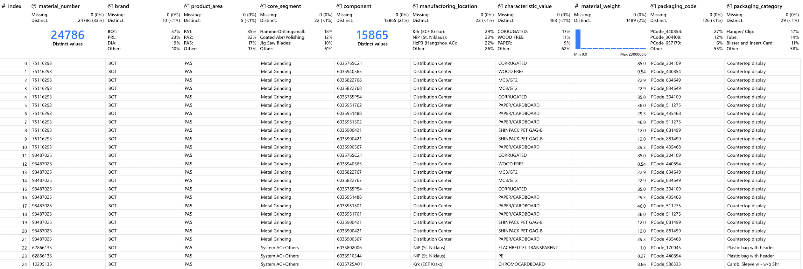

# 5. Building our Deep Learning Pipeline

## 5.1. Datasets, DataLoaders, LightningDataModule for Tabular Data

In this tutorial I demonstrate the usage of Datasets, DataLoaders, LightningDataModule for our use case with tabular data. The implementation and usage of these modules are slightly different than for more common deep learning use cases as for natural language processing (NLP) or computer vision (CV). The following section explains the concepts of how those modules are used for tabular data and should provide a guideline for the code implementation below.

- Logic of using `Datasets`, `DataLoaders` & `LightningDataModule` for **Tabular Data**
    
    Since we are using tabular data and want to perform non tensor based processing to our date, we use Datasets, DataLoaders & LightningDataModule in a different manner as we would do when applying tensor operations (incl. tensor based preprocessing) only.
    
    - `LightningDataModule`
    Our LightningDataModule builds the wrapper around this process, with the following intensions:
        - `def prepare_data`
        Data Operations that only should be performed once on the data (and should not be performed on a distributed manner). Prepares the data for data pre-processing e.g. using sklearn.
            - Loading the data from .csv to pd.DataFrame
            - General dataset preparations like feature selection and data type correction
        - `def setup`
        First, data operations (like shuffle, split data, categorical encoding, normalization, etc.), which any dataframe should undergo before feeding into the dataloader will be performed here. Since we use sklearn functionalities for our tabular pre-processing pipeline the data input and output of the pre-processing is a tabular format (dataframe) and not a tensor format.
        Second, the outcome of `def setup` are `Dataset` objects for each split (e.g. train, val, test, pred), which is a wrapper around the pre-processed tabular data and provides the samples and their corresponding labels (ideally in tensor format) in a specific way to be compatible for the model(s).
            - `Dataset`
            Dataset provides the samples and their corresponding labels in a specific way to be compatible for the model(s). We define the input for our tabular use case as a DataFrame, while the output should generally be a tensor. In our case the output is a tuple of tensors representing continuos features, categorical features and a tensor for the target variable (label).
            The class performs specific data type correction for to use of Neural Networks (e.g. ensure that all outputs are numeric values of the correct type depending of they are categorical or continuous nature).
        - `def train/val/test/prediction_dataloader`
        Creates our dataloaders within the LightningDataModule. See usage below.
            - `DataLoader`
            DataLoader wraps an iterable around the Dataset to enable easy access to the samples during training and inference. The Dataset defines the format of the data that is passed to our model. The DataLoader retrieves our dataset’s features and labels. While training a model, we typically want to pass samples in “minibatches”, reshuffle the data at every epoch to reduce model overfitting, and use Python’s multiprocessing to speed up data retrieval, which is handled by the DataLoader. Input and output is a tensor. https://pytorch.org/tutorials/beginner/basics/data_tutorial.html
- Excursion: Classical approach of using `Datasets`, `DataLoaders` & `LightningDataModule` for e.g. images, ...
    
    The main difference is the usage of tensors instead of a dataframe for efficient GPU usage.
    
    - `LightningDataModule`
    Our LightningDataModule builds the wrapper around this process. It encapsulates training, validation, testing, and prediction dataloaders, as well as any necessary steps for data processing, downloads, and transformations. https://lightning.ai/docs/pytorch/stable/data/datamodule.html
        - `def prepare_data`
        Loads the data and does general processing before transforming to a tensor, so efficient tensor operations can be enabled in `setup'.
        - `def setup`
        Efficient tensor operations (like shuffle, split data, categorical encoding, normalization, etc.), which any dataframe should undergo before feeding into the dataloader.
        - `def train/val/test_dataloader`
        Creates our dataloaders within the LightningDataModule.
    - `Dataset`
    Class to create tabular dataset to follow PyTorch Lightning conventions (even though we are working on tabular data), where the data for feature variables and the target variable are often already provided in a combined way (e.g. contrary to images and corresponding labels). For "classical" approaches a Dataset class is often used at the start of the machine learning pipeline to provide the data in a format (e.g. combine images and corresponding labels, which are typically not provided in the same file) for further processing and training.

### 5.1.1. Dataset for Tabular Data (Code Implementation)

The `TabularDataset` class is a custom implementation of PyTorch's `Dataset` for handling tabular data in classification and regression tasks. It is designed to preprocess tabular data, converting it into tensor format suitable for neural network training. The class supports both continuous and categorical features, with categorical columns assumed to be ordinal or label-encoded beforehand. It manages the target variable (`y`), which is handled as either a floating-point tensor for regression or an integer tensor for classification. The class ensures efficient data representation for use in PyTorch's data pipelines by handling necessary transformations such as type correction and tensor conversion. While data preprocessing (e.g., using `sklearn`) is typically done in a `LightningDataModule`, this class finalizes the data transformation and provides it in tensor form for consumption by the PyTorch DataLoader. Key features include flexibility in handling various column types, support for multiple task types (classification and regression), and integration with PyTorch’s data loading mechanism. The implementation of the class is not related to our use case data and can be reused for general purposes.

```python
class TabularDataset(Dataset):
    def __init__(
        self,
        data: pd.DataFrame = None,
        continuous_cols: Optional[List[str]] = None,
        categorical_cols: Optional[List[str]] = None,
        target: Optional[List[Union[str, int, float]]] = None,
        task: Literal["classification", "regression"] = "classification",
    ) -> None:
        """
        This class is customized for tabular related data for the use of classification and regression. Returns the tabular data as tensor format.
        Input data must be of numeric nature and should be ordinal or label encoded. This should be covered by a related LightningDataModule.
        Besides the standard functionality of the 'Dataset' class it provides data type correction to fit the requirements of Neural Networks and for efficient use of Neural Networks.
        NOTE: The common/original intention of using a Torch Dataset Class, is to provide the output of the data as tensors for further use of pytorch
              and to enable tensor operations. For our (and most) tabular datasets we neglect the aspect of tensor operations, since we do the data transformations (e.g. using sklearn),
              which are not tensor based, within a L.LightningDataModule. The TabularDataset class is used to provide the data as tensors to the DataLoaders as a final step after data preprocessing.

        Args:
            data (pd.DataFrame): Pandas DataFrame to load during training, validation, testing and prediction.
            continuous_cols (List[str], optional): A list of names of continuous columns.
            categorical_cols (List[str], optional): A list of names of categorical columns. These columns must be ordinal or label encoded beforehand.
            target (List[str], optional): A list of strings with target column name(s).
            task (str): Whether it is a classification or regression task. If classification, it returns a LongTensor as target.
        Returns:
            Corrected tabular data as tensor format.
        """
        # self.data = data
        self.task = task
        self.n_samples = data.shape[0]
        self.categorical_cols = categorical_cols
        self.continuous_cols = continuous_cols
        self.target = target

        # NOTE: input data must be ordinal or label encoded

        # target handling
        if self.target:
            self.y = data[self.target].astype(np.float32).values  # for regression task
            if self.task == "classification":
                # self.y = self.y.reshape(-1, 1).astype(np.int64) # for classification task, reshape for multi class classification (must be handled accordingly in the model)
                self.y = self.y.astype(np.int64)  # for classification task
        else:
            self.y = np.zeros((self.n_samples, 1))  # for regression task
            if self.task == "classification":
                self.y = self.y.astype(np.int64)  # for classification task

        # feature handling
        self.categorical_cols = self.categorical_cols if self.categorical_cols else []
        self.continuous_cols = self.continuous_cols if self.continuous_cols else []
        if self.continuous_cols:
            self.continuous_X = data[self.continuous_cols].astype(np.float32).values
        if self.categorical_cols:
            self.categorical_X = data[self.categorical_cols].astype(np.int64).values
            # self.categorical_X = self.categorical_X.astype(np.int64) # TODO: remove

    @property
    def get_dataframe(self) -> pd.DataFrame:
        """Creates and returns the dataset as a pandas dataframe."""
        if self.continuous_cols or self.categorical_cols:
            df = pd.DataFrame(
                dict(zip(self.continuous_cols, self.continuous_X.T))
                | dict(zip(self.categorical_cols, self.categorical_X.T))
            )
        else:
            df = pd.DataFrame()
        df[self.target] = self.y  # add target column

        return df

    def __len__(self) -> int:
        """Returns the total number of samples in the dataset."""
        return self.n_samples

    def __getitem__(self, idx: int = None) -> Dict[str, torch.Tensor]:
        """
        Generates one single sample of data of the dataset (row)
        and applies transformations to that sample if defined.
        Called iteratively based on batches and batch_size.
        Args:
            idx (int): index (between ``0`` and ``len(dataset) - 1``)

        Returns:
            Tuple[Dict[str, torch.Tensor], torch.Tensor]: x and y for model
        """

        return {
            "continuous": (torch.as_tensor(self.continuous_X[idx]) if self.continuous_cols else torch.Tensor()),
            "categorical": (torch.as_tensor(self.categorical_X[idx]) if self.categorical_cols else torch.Tensor()), #  dtype=torch.int64
            "target": torch.as_tensor(self.y[idx]) # , dtype=torch.long
        }
```

### 5.1.2. LightningDataModule (Code Implementation)

The `TabularDataModuleClassificationPACKAGING` class is a specialized implementation of PyTorch Lightning's `LightningDataModule` designed to handle tabular data for classification tasks. This class focuses on the specific requirements of a packaging dataset of the given use case, containing features like material number, brand, product area, and packaging category. It provides a reusable framework for preprocessing, data splitting, and handling both continuous and categorical variables. The data transformation pipeline includes imputation, scaling for continuous features, and ordinal encoding for categorical features, with a dedicated preprocessing pipeline for training, validation, testing, and inference scenarios.

Key features include the ability to perform oversampling to balance class distributions, support for splitting data into training, validation, and test sets, and handling of preprocessing for both training and prediction phases. The data is loaded and processed in a way that optimizes its compatibility with PyTorch models, offering flexibility for different stages like training, validation, and inference. This class also ensures reproducibility through a fixed random seed and provides easy integration with PyTorch’s `DataLoader` for efficient batch processing during model training and evaluation.

```python
class TabularDataModuleClassificationPACKAGING(L.LightningDataModule):
    def __init__(
        self,
        data_dir: str,
        continuous_cols: List[str] = None,
        categorical_cols: List[str] = None,
        target: List[str] = None,
        oversampling: bool = False,
        task_dataset: str = "classification",
        test_size: Optional[float] = None,
        val_size: Optional[float] = None,
        batch_size: int = 64,
        batch_size_inference: Optional[int] = None,
        num_workers_train: int = 0,
        num_workers_predict: int = 0,
        kwargs_dataloader_trainvaltest: Dict = {},
        kwargs_dataloader_predict: Dict = {},
        SEED: Optional[int] = 42,
    ) -> None:
        """
        The class processes the data accordingly, so that the output meets the requirements to be further use of PyTorch/Lightning.
        A sharable, reusable class that encapsulates data loading and data preprocessing logic for classification.
        The class provides general data handling and very specific data handling to the 'Packaging Dataset' ('number` and 'object' types as variables are supported, but no other e.g. like 'date').
        NOTE: In addition, the common/original intention of using a L.LightningDataModule is to perform data operations on tensors to improve compute performance. For our (and most) tabular datasets we neglect this aspect,
            since we perform data transformations, which are not tensor based. Therefore data preprocessing and transformations are organized within the class methods 'prepare_data' and 'setup',
            based on if they should be performed a single time only or multiple times (e.g. on each split separately).
        NOTE: Be aware of the status of your pre-processing pipeline / transformers (data they are fit on) - performance optimization vs. final evaluation vs. inference only.
            The stage parameter ('fit' or 'inference') in def _preprocessing_pipeline controls this internal logic.
        NOTE: Training, validation, testing and prediction are triggered by the Lightning Trainer() methods (.fit(), .validate(), .test() and .predict()).
            The stage parameter ('fit', 'validate', 'test' and 'predict') controls the internal logic to provide the correct data splitting and dataloader generation.

        Args:
            data_dir (str): The directory where the data is stored.
            continuous_cols (List[str], optional): A list of column names for continuous variables. Defaults to None.
            categorical_cols (List[str], optional): A list of column names for categorical variables. Defaults to None.
            target (List[str], optional): A list of column names for the target variable. Defaults to None.
            oversampling (bool, optional): Whether to perform oversampling. Defaults to False.
            task_dataset (str, optional): The type of task dataset. Defaults to 'classification'.
            test_size (Optional[float], optional): The size of the test set. Defaults to None.
            val_size (Optional[float], optional): The size of the validation set. Defaults to None.
            batch_size (int, optional): The batch size for training. Defaults to 64.
            batch_size_inference (Optional[int], optional): The batch size for inference. Defaults to None.
            num_workers_train (int, optional): The number of workers for training. Defaults to 0, which is the main thread (always recommended).
            num_workers_predict (int, optional): The number of workers for inference. Defaults to 0, which is the main thread (always recommended).
            kwargs_dataloader_trainvaltest (Dict, optional): Additional keyword arguments for the dataloader for training, validation, and testing. Defaults to {}.
            kwargs_dataloader_predict (Dict, optional): Additional keyword arguments for the dataloader for prediction. Defaults to {}.
            SEED (Optional[int], optional): The seed for reproducibility. Defaults to 42.
        """
        super().__init__()
        # self.save_hyperparameters()
        self.data_dir = data_dir
        self.categorical_cols = categorical_cols if categorical_cols else []
        self.continuous_cols = continuous_cols if continuous_cols else []
        self.task_dataset = task_dataset
        self.task = task_dataset
        self.test_size = test_size
        self.val_size = val_size
        self.target = target
        self.oversampling = oversampling
        self.batch_size = batch_size
        self.batch_size_inference = self.batch_size if not batch_size_inference else batch_size_inference
        self.num_workers_train = num_workers_train
        self.num_workers_predict = num_workers_predict
        self.kwargs_dataloader_trainvaltest = kwargs_dataloader_trainvaltest
        self.kwargs_dataloader_predict = kwargs_dataloader_predict
        self.stage_setup = None
        self.SEED = SEED

        self._prepare_data_called = False

    def _prepare_data(self, data: pd.DataFrame) -> pd.DataFrame:
        """
        Performs general, use case independent data input handling and data type handling.
        Used internal in 'prepare_data' for train, val and test dataloaders and in 'inference_dataloader' for prediction.
        Target specific handlings are performed in 'prepare_data' to avoid conflicts during inference only scenarios where the target is not available.
        General data preparation involves:
            - transform target variable to data type 'object' for classification tasks and to data type 'float32' for regression tasks.
            - transform continuous feature variables to data type 'np.float32'.
            - transform categorical feature variables to data type 'object'.
            - update the processed dataframe accordingly and drops not specified columns.
        """
        if self.task == "classification":
            # transform target variable to data type 'object'
            data[self.target] = data[self.target].astype("object").values
        elif self.task == "regression":
            # transform target variable to data type 'float32'
            data[self.target] = data[self.target].astype(np.float32).values

        if len(self.continuous_cols) > 0:
            # continuous_cols will be transformed to float32 ('32' for performance reasons) since NNs do not handle int properly.
            data[self.continuous_cols] = data[self.continuous_cols].astype(np.float32).values
        if len(self.categorical_cols) > 0:
            # ensure that all categorical variables are of type 'object'
            data[self.categorical_cols] = data[self.categorical_cols].astype('object').values

        if (len(self.continuous_cols) > 0) or (len(self.categorical_cols) > 0):
            self.feature_cols = self.continuous_cols + self.categorical_cols
            pass
        else:
            raise TypeError("Missing required argument: 'continuous_cols' and/or 'categorical_cols'")

        # Define a subset based on continuous_cols and categorical_cols
        data = data[self.continuous_cols + self.categorical_cols + self.target]

        return data

    def _preprocessing_pipeline(
        self, X: pd.DataFrame = None, y: pd.DataFrame = None, stage: str = "fit"
    ) -> pd.DataFrame:
        """
        PREPROCESSING PIPELINE, used internal in 'setup' for train, val and test dataloaders and in 'inference_dataloader',
        as well as for inverse transformations.
        TabularDatasetPACKAGING prepares data for prediction only accordingly to support _preprocessing_pipeline.
        """
        # create pipeline for fit scenario, use existing pipeline for inference scenario
        if stage == "fit":
            # numerical feature processing
            numerical_features = X.select_dtypes(include='number').columns.tolist()
            numeric_feature_pipeline = Pipeline(steps=[
                ('impute', SimpleImputer(strategy='median')),
                ('scale', StandardScaler())
            ])
            # categorical feature processing
            categorical_features = X.select_dtypes(exclude='number').columns.tolist()
            categorical_feature_pipeline = Pipeline(steps=[
                ('impute', SimpleImputer(strategy='most_frequent')),
                ('ordinal', OrdinalEncoder(handle_unknown='use_encoded_value', unknown_value=-1)), # ordinal is used instead of label encoder to avoid conflicts with inference or
                ('nan_label', encoders.OrdinalEncoderExtensionUnknowns()),
            ])
            # apply both pipeline on seperate columns using "ColumnTransformer"
            self.preprocess_pipeline = ColumnTransformer(transformers=[
                ('number', numeric_feature_pipeline, numerical_features),
                ('category', categorical_feature_pipeline, categorical_features)],
                verbose_feature_names_out=False)
            self.preprocess_pipeline.set_output(transform="pandas")

            # ordinal is used instead of label encoder to avoid conflicts with inference or
            # conflicts caused by data splits of categories with low number of classes only scenarios
            self.label_encoder_target = OrdinalEncoder(handle_unknown='use_encoded_value', unknown_value=-1)
            # self.label_encoder_target = LabelEncoder()

        if stage == "fit":
            X_transformed = self.preprocess_pipeline.fit_transform(X)
            y_transformed = pd.DataFrame(data=self.label_encoder_target.fit_transform(y.values.reshape(-1, 1)), index=y.index, columns=y.columns)
        elif stage == 'inference':
            X_transformed = self.preprocess_pipeline.transform(X)
            y_transformed = pd.DataFrame(data=self.label_encoder_target.transform(y.values.reshape(-1, 1)), index=y.index, columns=y.columns)
        else:
            raise ValueError(f"Missing required argument 'stage', must be 'fit' or 'inference', got {stage}")

        return pd.concat([X_transformed, y_transformed], axis=1)

    def prepare_data(self, shuffle: bool = False) -> None:
        """Custom data specific operations and basic tabular specific operations that only should be performed once on the data (and should not be performed on a distributed manner).
        Load the data as Tabular Data as a Pandas DataFrame from a .csv file and performs custom data processing related to loading a .csv file (data type correction) and defining a subset of features.
        In addition "_prepare_data" performance general data preparation for the classification/regression task and perform basic data error handling. General data preparation involves:
            - transform target variable to data type 'object'.
            - update the processed dataframe accordingly and drops not specified columns.
            - shuffle the data (rows).
        """

        # USE CASE SPECIFIC DATA HANDLING
        self.data = pd.read_csv(self.data_dir, sep="\t")
        # for inference mode, as the target might not be provided in the data, ensures pre-processing pipeline completes correctly.
        if 'packaging_category' not in self.data.columns:
            self.data.insert(len(self.data.columns), 'packaging_category', np.nan) # Insert an empty column at the end (position=-1)
        # define the subset
        self.data = self.data[[
            'material_number',
            'brand',
            'product_area',
            'core_segment',
            'component',
            'manufactoring_location',
            'characteristic_value',
            'material_weight',
            'packaging_code',
            'packaging_category',
        ]]
        self.data['material_number'] = self.data['material_number'].astype('object')

        if self.oversampling:
            # NOTE: Oversampling so each class has at least 100 sample; to properly represent minority classes during training and evaluation
            X = self.data.iloc[:, :-1]
            y = self.data.iloc[:, -1]  # the last column is the target, ensured based on section before (# select a subset)
            dict_oversampling = {
                "Metal Cassette": 100,
                "Carton tube with or w/o": 100,
                "Wooden box": 100,
                "Fabric packaging": 100,
                "Book packaging": 100,
            }
            oversampler = RandomOverSampler(sampling_strategy=dict_oversampling, random_state=self.SEED)
            X_oversample, y_oversample = oversampler.fit_resample(X, y)
            self.data = pd.concat([X_oversample, y_oversample], axis=1)

        # GENERAL DATA HANDLING
        self.data = self._prepare_data(self.data)

        # shuffle data
        if shuffle is True: self.data = self.data.sample(frac=1)

        self.n_samples = self.data.shape[0]

        self._prepare_data_called = True

    def setup(self, stage: str = None) -> None:
        """Data Operations (like shuffle, split data, categorical encoding, normalization, etc.) that will be performed multiple times, which any dataframe should undergo before feeding into the dataloader.
        Since on tabular data, operations like transformations (categorical encoding, normalization, etc.) needs to be performed with respect to all samples (respectively separate per train, val, test split),
        most operations are not performed in DDP way. See class docstring for further details regarding tabular data and tensor transformations.

        Args:
            test_size (Optional[float], optional):
                Defines the hold out split that should be used for final performance evaluation. If 'None' no split will be performed and all data is used in 'fit'
            val_size (Optional[float], optional):
                Defines an additional split on the train data that should be used for model optimization. If 'None' no val split will be performed and all train data is used in 'fit'
            stage (Optional[str], optional):
                Internal parameter to distinguish between 'fit', 'validate', 'test' and 'predict'. Defaults to None.
        """

        self.stage_setup = stage

        if not self._prepare_data_called:
            raise RuntimeError("'prepare_data' needs to be called before 'setup'")

        # Define features and target
        X = self.data.iloc[:, :-1]
        y = self.data.iloc[:, -1]  # the last column is the target, ensured by calling 'prepare_data' upfront

        # Define data for train, val and test and for prediction
        if stage in ("fit", "validate", "test"):
            # Generate train, val and test data splits
            if self.test_size is not None:
                X_train, X_test, y_train, y_test = train_test_split(
                    X, y, test_size=self.test_size, stratify=y, random_state=self.SEED
                )
                X_train = pd.DataFrame(data=X_train, columns=X.columns)
                y_train = pd.DataFrame(data=y_train, columns=[y.name])
                X_test = pd.DataFrame(data=X_test, columns=X.columns)
                y_test = pd.DataFrame(data=y_test, columns=[y.name])
                if (self.val_size is not None) and (self.test_size is not None):
                    X_train, X_val, y_train, y_val = train_test_split(
                        X_train, y_train, test_size=self.val_size, stratify=y_train, random_state=self.SEED
                    )
                    X_train = pd.DataFrame(data=X_train, columns=X.columns)
                    y_train = pd.DataFrame(data=y_train, columns=[y.name])
                    X_val = pd.DataFrame(data=X_val, columns=X.columns)
                    y_val = pd.DataFrame(data=y_val, columns=[y.name])
            else:
                X_train = X
                y_train = pd.DataFrame(data=y, columns=[y.name])
        elif stage == "predict":
            X_pred = X
            y_pred = pd.DataFrame(data=y, columns=[y.name])
        else:
            raise ValueError(f"Stage must be 'fit', 'validate', 'test' or 'predict', got {stage}")

        # pre-process data
        if stage in ("fit", "validate", "test"):
            # the logic ensures that y_train is during all training scenarios and inference scenario always the right reference for number of classes.
            tabular_train = self._preprocessing_pipeline(X_train, y_train, stage="fit")
            if self.test_size is not None:
                tabular_test = self._preprocessing_pipeline(X_test, y_test, stage='inference')
            if (self.val_size is not None) and (self.test_size is not None):
                tabular_val = self._preprocessing_pipeline(X_val, y_val, stage='inference')
            # n_classes is calculated based on set of unique classes in train, val, test after preprocessing to handle unknown classes properly.
            self.n_classes = len(
                set(tabular_train[y.name].unique())
                .union(*(set(df[y.name].unique()) for df in (tabular_val, tabular_test) if df is not None))
            )
        elif stage == 'predict':
            tabular_predict = self._preprocessing_pipeline(X_pred, y_pred, stage='inference')

        # create datasets
        # NOTE: instantiation of datasets (train, val test) in stage == ('fit', 'validate', 'test') is controlled by self.test_size and self.val_size
        #       instantiation of datasets (predict) is controlled by stage == 'predict'
        if stage in ("fit", "validate", "test"):
            self.train_dataset = TabularDataset(
                data=tabular_train,
                continuous_cols=self.continuous_cols,
                categorical_cols=self.categorical_cols,
                target=self.target,
                task=self.task_dataset,
            )
            if self.test_size is not None:
                self.test_dataset = TabularDataset(
                    data=tabular_test,
                    continuous_cols=self.continuous_cols,
                    categorical_cols=self.categorical_cols,
                    target=self.target,
                    task=self.task_dataset,
                )
            if (self.val_size is not None) and (self.test_size is not None):
                self.val_dataset = TabularDataset(
                    data=tabular_val,
                    continuous_cols=self.continuous_cols,
                    categorical_cols=self.categorical_cols,
                    target=self.target,
                    task=self.task_dataset,
                )
        elif stage == "predict":
            self.predict_dataset = TabularDataset(
                data=tabular_predict,
                continuous_cols=self.continuous_cols,
                categorical_cols=self.categorical_cols,
                target=self.target,
                task=self.task_dataset,
            )
        else:
            raise ValueError(f"Stage must be 'fit', 'validate', 'test' or 'predict', got {stage}")

    def train_dataloader(self) -> DataLoader:
        """Dataloader that the Trainer fit() method uses.
        Args:
            batch_size (Optional[int], optional): Batch size. Defaults to `self.batch_size`.
        Returns:
            DataLoader: Train dataloader
        """
        return DataLoader(
            self.train_dataset,
            batch_size=self.batch_size,
            shuffle=True,
            drop_last=True,
            num_workers=self.num_workers_train,
            **self.kwargs_dataloader_trainvaltest,
        )

    def val_dataloader(self) -> DataLoader:
        """Dataloader that the Trainer fit() and validate() methods uses.
        Args:
            batch_size (Optional[int], optional): Batch size. Defaults to `self.batch_size`.
        Returns:
            DataLoader: Validation dataloader
        """
        return DataLoader(
            self.val_dataset,
            batch_size=self.batch_size,
            shuffle=False,
            num_workers=self.num_workers_train,
            **self.kwargs_dataloader_trainvaltest,
        )

    def test_dataloader(self) -> DataLoader:
        """Dataloader that the Trainer test() method uses.
        Args:
            batch_size (Optional[int], optional): Batch size. Defaults to `self.batch_size`.
        Returns:
            DataLoader: Test dataloader
        """
        return DataLoader(
            self.test_dataset,
            batch_size=self.batch_size,
            shuffle=False,
            num_workers=self.num_workers_train,
            **self.kwargs_dataloader_trainvaltest,
        )

    def predict_dataloader(self) -> DataLoader:
        """Dataloader that the Trainer predict() method uses.
        Used for predictions for data with unknown target (labes).
        Args:
            batch_size (Optional[int], optional): Batch size. Defaults to `self.batch_size`.
        Returns:
            DataLoader: Test dataloader
        """
        if self.stage_setup == 'predict':
            return DataLoader(
                self.predict_dataset,
                batch_size=self.batch_size_inference,
                shuffle=False,
                num_workers=self.num_workers_predict,
                **self.kwargs_dataloader_predict,
            )
        else:
            return None
```

### 5.1.3. Instantiation of TabularDataModuleClassificationPACKAGING with our use case data (Code Implementation)

```python
dm = TabularDataModuleClassificationPACKAGING(
    data_dir=f"{config['data_directory']}/output/df_ml.csv",
    continuous_cols=['material_weight'],
    categorical_cols=[
        'material_number',
        'brand',
        'product_area',
        'core_segment',
        'component',
        'manufactoring_location',
        'characteristic_value',
        'packaging_code'
    ],
    target=['packaging_category'],
    oversampling=True,
    test_size=0.2,
    val_size=0.2,
    batch_size=64,
    SEED=SEED
)

# NOTE: Run dm.prepare_data() and dm.setup() to get information from the dataset to build the model.
dm.prepare_data()
dm.setup(stage='fit')

# Plot processed data
dm.train_dataset.get_dataframe.head(5)
```

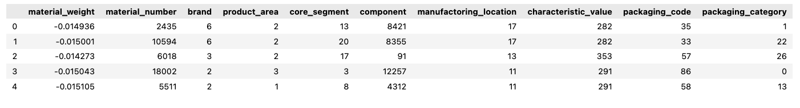

## 5.2. LightningModule & LightningTrainer for Tabular Data

The LightningModule and the LightningTrainer can be used straight forward for tabular data.

### 5.2.1. LightningModule (Code Implementation)

The `MulticlassTabularLightningModule` is a PyTorch Lightning `LightningModule` designed for multiclass classification tasks on tabular data. This module is built to handle the entire training and evaluation pipeline for a multiclass classification model. It supports a customizable neural network model, loss function, and metrics for tracking performance across training, validation, and test sets. The class is design in a way that it is not specific to our use case data and can be reused for other multiclass classification tasks without any adaptation needed.

The module performs forward passes through a given model and computes the loss using cross-entropy. It includes common steps like training, validation, and testing, with support for logging key metrics such as loss and F1-score (macro-weighted). During each step, it tracks performance by logging metrics like loss and accuracy, allowing for seamless integration with PyTorch Lightning's training loop. Additionally, it includes a `predict_step` for making predictions on unseen data, outputting the class with the highest predicted probability.

The model's optimizer is configured as the Adam optimizer with a user-specified learning rate. The `MulticlassTabularLightningModule` is a versatile framework for multiclass classification, offering flexibility and ease of use for training and evaluation in tabular data scenarios.

```python
class MulticlassTabularLightningModule(L.LightningModule):
    def __init__(
        self,
        model: nn.Module = None,
        learning_rate: float = 0.001,
        train_acc: Metric = None,
        val_acc: Metric = None,
        test_acc: Metric = None,
    ) -> None:
        """LightningModule for multiclass classification.
        Args:
            n_classes (int): Number of classes.
            model (nn.Module): Model to be trained.
            learning_rate (float): Learning rate.
            train_acc (Metric): Metric for training loss/accuracy.
            val_acc (Metric): Metric for validation loss/accuracy.
            test_acc (Metric): Metric for test loss/accuracy.
        """
        super().__init__()
        # self.save_hyperparameters()
        self.model = model
        self.learning_rate = learning_rate
        self.train_acc = train_acc
        self.val_acc = val_acc
        self.test_acc = test_acc

    def forward(self, x: Dict[str, torch.Tensor]) -> torch.Tensor:
        """Forward pass through the MLP."""
        return self.model(x)

    def _shared_step(self, batch: Dict[str, torch.Tensor], batch_idx) -> Tuple[torch.Tensor]:
        x = {key: batch[key] for key in ["continuous", "categorical"]}
        y = batch["target"].flatten()  # flatten to match input shape of F.cross_entropy
        y_hat = self.forward(x)
        loss = F.cross_entropy(y_hat, y)
        y_hat = torch.argmax(y_hat, dim=1) # provides the class with the highest probability to match the shape of y
        return (loss, y_hat, y)

    def training_step(self, batch, batch_idx) -> torch.Tensor:
        loss, y_hat, y = self._shared_step(batch, batch_idx)
        self.log(f"train_loss", loss)
        self.train_acc(y_hat, y)
        self.log("train_F1_macro_weighted", self.train_acc, prog_bar=True, on_epoch=True, on_step=False)
        return loss

    def validation_step(self, batch, batch_idx) -> None:
        loss, y_hat, y = self._shared_step(batch, batch_idx)
        self.log("val_loss", loss, prog_bar=True)
        self.val_acc(y_hat, y)
        self.log("val_F1_macro_weighted", self.val_acc, prog_bar=True)
        return

    def test_step(self, batch, batch_idx) -> None:
        _, y_hat, y = self._shared_step(batch, batch_idx)
        self.test_acc(y_hat, y)
        self.log("test_F1_macro_weighted", self.test_acc)
        return

    def predict_step(self, batch, batch_idx) -> torch.Tensor:
        x = {key: batch[key] for key in ["continuous", "categorical"]}
        y_hat = self.forward(x)
        preds = torch.argmax(y_hat, dim=1)
        return preds

    def configure_optimizers(self) -> torch.optim.Adam:
        return torch.optim.Adam(params=self.parameters(), lr=self.learning_rate)
```

### 5.2.2. Multi-Layer-Perceptron (MLP) Model Definition (Code Implementation)

The `MulticlassTabularMLP` is a multi-layer perceptron (MLP) model designed for multiclass classification tasks on tabular data. This model is highly customizable, allowing for adjustable input size, output size (number of classes), hidden layer configuration, activation functions, dropout rates, and normalization options. The MLP consists of an input layer, multiple hidden layers, and an output layer, with each hidden layer followed by an optional dropout layer and layer normalization.

The forward pass concatenates continuous and categorical input features before passing them through the network. The model uses a sequential structure where each layer is specified by the user-defined parameters, including the number of hidden layers, neurons, and activation functions (default is ReLU). Dropout and layer normalization are optional, allowing for flexibility in preventing overfitting and improving model generalization.

```python
class MulticlassTabularMLP(nn.Module):
    def __init__(
        self,
        input_size: int = None,
        output_size: int = None,
        hidden_size: int = None,
        n_hidden_layers: int = None,
        activation_class: nn.Module = nn.ReLU,
        dropout: float = None,
        norm: bool = True,
    ) -> None:
        """Multi Layer Perceptron (MLP) for multiclass classification for tabular data.
        Args:
            input_size (int): Number of input features.
            output_size (int): Number of output classes.
            hidden_size (int): Number of neurons in hidden layers.
            n_hidden_layers (int): Number of hidden layers.
            activation_class (nn.Module): Activation function.
            dropout (float): Dropout rate.
            norm (bool): Whether to use layer normalization.
        """
        super().__init__()
        self.input_size = input_size
        self.output_size = output_size
        self.hidden_size = hidden_size
        self.n_hidden_layers = n_hidden_layers
        self.activation_class = activation_class
        self.dropout = dropout
        self.norm = norm

        ### define MLP ###
        # input layer
        module_list = [nn.Linear(input_size, hidden_size), activation_class()]
        if dropout is not None:
            module_list.append(nn.Dropout(dropout))
        if norm:
            module_list.append(nn.LayerNorm(hidden_size))
        # hidden layers
        for _ in range(n_hidden_layers):
            module_list.extend([nn.Linear(hidden_size, hidden_size), activation_class()])
            if dropout is not None:
                module_list.append(nn.Dropout(dropout))
            if norm:
                module_list.append(nn.LayerNorm(hidden_size))
        # output layer
        module_list.append(nn.Linear(hidden_size, output_size))

        self.sequential = nn.Sequential(*module_list)

    def forward(self, x: Dict[str, torch.Tensor]) -> torch.Tensor:
        """Forward pass through the MLP."""
        # concatenate continuous and categorical features
        network_input = torch.cat((x["continuous"], x["categorical"]), dim=1) # NOTE: converts all data types to float32 (respective to the data type of the first element)
        return self.sequential(network_input)
```

### 5.2.3. MLP with Categorical Feature Embeddings Model Definition (Code Implementation)

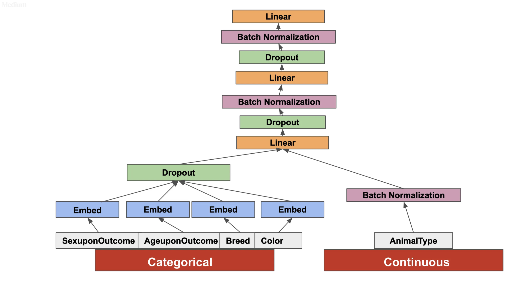
*Image Source: [[Link to Source](https://towardsdatascience.com/deep-learning-for-tabular-data-using-pytorch-1807f2858320)]*

The `MulticlassTabularCatEmbeddingMLP` is an advanced multi-layer perceptron (MLP) model tailored for multiclass classification tasks on tabular data, with a specific focus on handling both continuous and categorical features through embedding layers. The model integrates embeddings for categorical variables to efficiently represent high-cardinality features and combines them with continuous features using normalization techniques.

The model accepts a list of continuous and categorical columns, with the categorical columns being processed using learned embedding layers. The continuous columns undergo batch normalization before being concatenated with the embedded categorical features. This concatenated input is then passed through a series of fully connected layers, which include configurable options for hidden layer size, dropout, and layer normalization, enhancing the model's capacity to generalize.

Overall, the `MulticlassTabularCatEmbeddingMLP` is designed to handle diverse tabular data by embedding categorical variables, thereby improving performance in scenarios with complex interactions between categorical and continuous features, while also providing flexibility in architecture design.

```python
class MulticlassTabularCatEmbeddingMLP(nn.Module):
    def __init__(
        self,
        continuous_cols: List[str] = None,
        categorical_cols: List[str] = None,
        output_size: int = None,
        # embedding_dim: int = None,
        hidden_size: int = None,
        n_hidden_layers: int = None,
        activation_class: nn.Module = nn.ReLU,
        dropout: float = None,
        norm: bool = True,
        embedding_sizes: Dict[str, Tuple[int, int]] = None,
    ) -> None:
        """Embedding Multi Layer Perceptron (embMLP) with embedding for categorical features for multiclass classification for tabular data.
        Args:
            continues_cols (List[str]): order of continuous variables in tensor passed to forward function.
            categorical_cols (List[str]): order of categorical variables in tensor passed to forward function.
            output_size (int): Number of output classes.
            hidden_size (int): Number of neurons in hidden layers.
            n_hidden_layers (int): Number of hidden layers.
            activation_class (nn.Module): Activation function.
            dropout (float): Dropout rate.
            norm (bool): Whether to use layer normalization.
            embedding_sizes (Dict[str, Tuple[int, int]]): Dictionary of embedding sizes for each categorical feature.
        """
        super().__init__()
        self.continuous_cols = continuous_cols
        self.categorical_cols = categorical_cols
        self.output_size = output_size
        self.embedding_sizes = embedding_sizes
        # self.embedding_dim = embedding_dim
        self.hidden_size = hidden_size
        self.n_hidden_layers = n_hidden_layers
        self.activation_class = activation_class
        self.dropout = dropout
        self.norm = norm

        ### define the Embedding MLP ###
        ## embedding layers
        # cont features
        self.cont_normalizing = nn.BatchNorm1d(len(self.continuous_cols))
        # cat features
        self.cat_embeddings = nn.ModuleDict()
        for name in embedding_sizes.keys():
            self.cat_embeddings[name] = nn.Embedding(
                embedding_sizes[name][0],
                embedding_sizes[name][1],
            )
        ## input layer mlp
        mlp_input_size = sum(value[1] for value in embedding_sizes.values()) + len(self.continuous_cols)
        module_list = [nn.Linear(mlp_input_size, hidden_size), activation_class()]
        if dropout is not None:
            module_list.append(nn.Dropout(dropout))
        if norm:
            module_list.append(nn.LayerNorm(hidden_size))
        ## hidden layers
        for _ in range(n_hidden_layers):
            module_list.extend([nn.Linear(hidden_size, hidden_size), activation_class()])
            if dropout is not None:
                module_list.append(nn.Dropout(dropout))
            if norm:
                module_list.append(nn.LayerNorm(hidden_size))
        ## output layer
        module_list.append(nn.Linear(hidden_size, output_size))

        self.mlp_layers = nn.Sequential(*module_list)

    def forward(self, x: Dict[str, torch.Tensor]) -> torch.Tensor:
        """Forward pass through the embMLP."""

        assert "continuous" in x or "categorical" in x, "x must contain either continuous or categorical features"

        ### forward embedding layers ###
        # cont features
        if len(self.continuous_cols) > 0:
            embed_vector_cont = self.cont_normalizing(x["continuous"])
        else:
            embed_vector_cont = x["continuous"]
        # cat features
        if len(self.categorical_cols) > 0:
            output_vectors = {}
            for idx, (name, emb) in enumerate(self.cat_embeddings.items()):
                output_vectors[name] = emb(x["categorical"][:, idx])
            embed_vector_cat = torch.cat(list(output_vectors.values()), dim=1)
        # output_vector_emded
        if embed_vector_cont is None:
            output_vector_emded = embed_vector_cat
        else:
            output_vector_emded = torch.cat([embed_vector_cont, embed_vector_cat], dim=1)

        ### forward hidden layers ###
        return self.mlp_layers(output_vector_emded)
```

In machine learning, especially when working with tabular data that includes categorical features, using embeddings can greatly enhance the performance of models. This code provides a systematic approach to determine the optimal embedding sizes for categorical features based on the number of unique categories in each feature. The function `get_embedding_size` within `get_cat_feature_embedding_sizes` uses an empirical formula to calculate a suitable embedding size, ensuring it doesn't exceed a predefined maximum value. Meanwhile, `get_cat_feature_embedding_sizes` computes embedding sizes for each categorical feature in a dataset and accounts for the padding token required by the embedding layer. This helps in preparing categorical data for models that leverage embeddings, such as neural networks.

```python
tabular_data_full = pd.concat([dm.train_dataset.get_dataframe, dm.val_dataset.get_dataframe, dm.test_dataset.get_dataframe], axis=0, ignore_index=True)
embedding_sizes_cat_features = tl_utils.get_cat_feature_embedding_sizes(tabular_data_full, categorical_cols=dm.categorical_cols)
embedding_sizes_cat_features
```

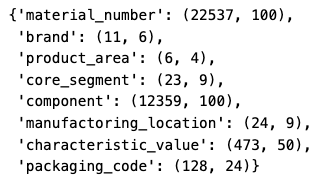

### 5.2.4. Instantiation of MLP Model and MulticlassTabularLightningModule (Code Implementation)

```python
# NOTE: Run dm.prepare_data() and dm.setup() to get information from the dataset to build your model.
multiclass_mlp = MulticlassTabularMLP(
    input_size=len(dm.feature_cols),
    output_size=dm.n_classes,
    hidden_size=64,
    n_hidden_layers=3,
    dropout=0.2,
    norm=True,
)
```

```python
# NOTE: Run dm.prepare_data() and dm.setup() to get information from the dataset to build your model.
multiclass_embMLP = MulticlassTabularCatEmbeddingMLP(
    continuous_cols=dm.continuous_cols,
    categorical_cols=dm.categorical_cols,
    output_size=dm.n_classes,
    hidden_size=64,
    n_hidden_layers=3,
    dropout=0.2,
    norm=True,
    embedding_sizes=embedding_sizes_cat_features
)
```

| MLP Model Parameters | embMLP Model Parameters |
|---|---|
| 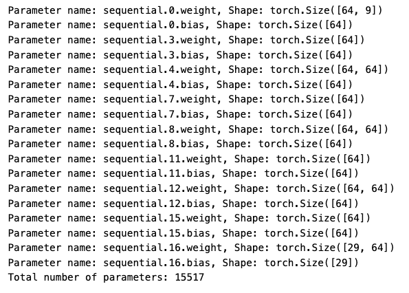 | 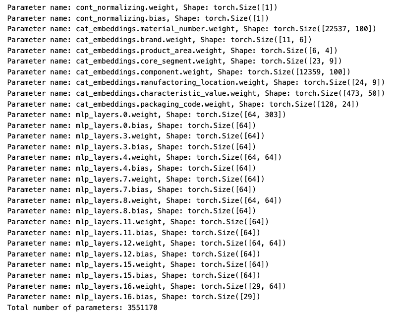 |

```python
lightningmodel = MulticlassTabularLightningModule(
    model=multiclass_mlp, # equivalent to multiclass_embMLP
    learning_rate=0.001,
    train_acc = MulticlassF1Score(num_classes=dm.n_classes, average='weighted'),
    val_acc = MulticlassF1Score(num_classes=dm.n_classes, average='weighted'),
    test_acc = MulticlassF1Score(num_classes=dm.n_classes, average='weighted'),
)
```

### 5.2.5. Training & Evaluation with LightningTrainer (Code Implementation)

The model is trained using the `trainer.fit()` method, with both training and validation data provided via respective data loaders. This step combines all previous steps, the data is passed through the training and validation loops by the `trainer` that integrates with our `lightningmodel` and `datamodule`. The script is designed to train and evaluate our multi-layer perceptron (MLP) model with the following key steps in the workflow:

1. **Trainer Configuration**: A `Trainer` is instantiated with various configurations, including automatic device selection, early stopping based on validation loss, and a CSV logger to track experiment results. The training process is set to run for a maximum of 100 epochs with mixed precision training (`bf16`).
2. **Learning Rate Finder**: Using PyTorch Lightning's `Tuner`, the script automatically determines an optimal learning rate by leveraging the learning rate finder (`lr_find`). The learning rate is then updated in the model's hyperparameters based on the suggested value from the `lr_finder`.
3. **Model Training**: The model is trained using the `trainer.fit()` method, with both training and validation data provided via respective data loaders.
4. **Plotting Training Metrics**: After training, the training metrics (such as loss and accuracy) are read from the logged CSV file and visualized using a custom function (`plot_training_metrics`).
5. **Testing**: The trained model is evaluated on the test set with the `trainer.test()` method.
6. **Prediction:** Finally the trained model is used for prediction scenario on the test data for a more detailed evaluation of the classification performance based on the `classification_report`. the `inverse_transform` functionality of the `datamodule` easily enables transformations of the predictions from the model back to the original labels.

```python
mlp_experiment_name = "MLP-v0"

trainer = L.Trainer(
    devices="auto", # (os.cpu_count() / 2)
    callbacks=[EarlyStopping(monitor='val_loss', min_delta=0.00, patience=5),],
    logger=CSVLogger(save_dir="logs/", name=mlp_experiment_name),
    max_epochs=100,
    precision='bf16-mixed',
    default_root_dir="lightning_logs/",
)

# Create a Tuner
tuner = Tuner(trainer)
# finds learning rate automatically and update hparams.lr to that learning rate
lr_finder = tuner.lr_find(lightningmodel, datamodule=dm)
fig = lr_finder.plot(suggest=True)
# get suggestion
new_lr = lr_finder.suggestion()
# update hparams of the model
lightningmodel.learning_rate = new_lr

# training
trainer.fit(
		model=lightningmodel, train_dataloaders=dm.train_dataloader(), val_dataloaders=dm.val_dataloader()
)

# plot training metrics
metrics = pd.read_csv(f"{trainer.logger.log_dir}/metrics.csv")
plot_training_metrics(metrics)

# test performance on test data
trainer.test(model=lightningmodel, dataloaders=dm.test_dataloader())
```
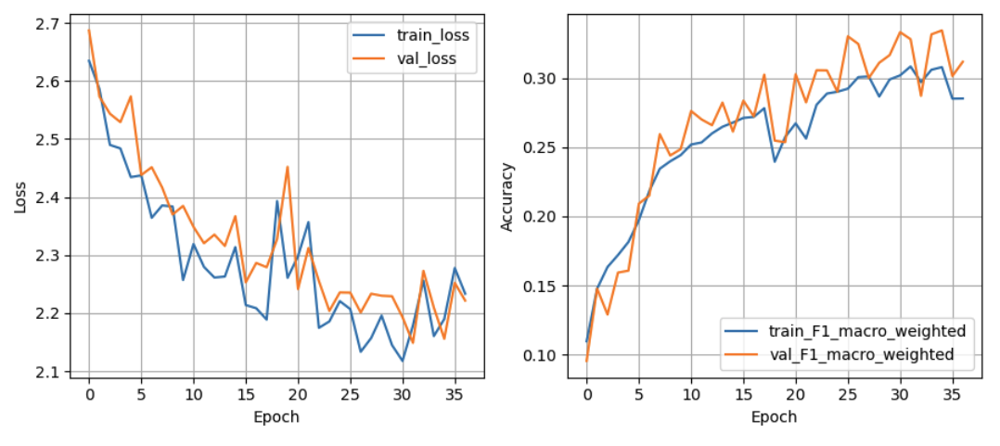

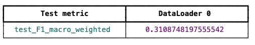

```python
empmlp_experiment_name = "embMLP-v0"

trainer = L.Trainer(
    devices="auto", # (os.cpu_count() / 2)
    callbacks=[EarlyStopping(monitor='val_loss', min_delta=0.00, patience=5)]
    logger=CSVLogger(save_dir="logs/", name=empmlp_experiment_name),
    max_epochs=100,
    precision='bf16-mixed',
    default_root_dir="lightning_logs/",
)

# Create a Tuner
tuner = Tuner(trainer)
# finds learning rate automatically and update hparams.lr to that learning rate
lr_finder = tuner.lr_find(lightningmodel, datamodule=dm)
fig = lr_finder.plot(suggest=True)
# get suggestion
new_lr = lr_finder.suggestion()
# update hparams of the model
lightningmodel.learning_rate = new_lr

# training
trainer.fit(
		model=lightningmodel, train_dataloaders=dm.train_dataloader(), val_dataloaders=dm.val_dataloader()
)

# plot training metrics
metrics = pd.read_csv(f"{trainer.logger.log_dir}/metrics.csv")
plot_training_metrics(metrics)

# test performance on test data
trainer.test(model=lightningmodel, dataloaders=dm.test_dataloader())
```

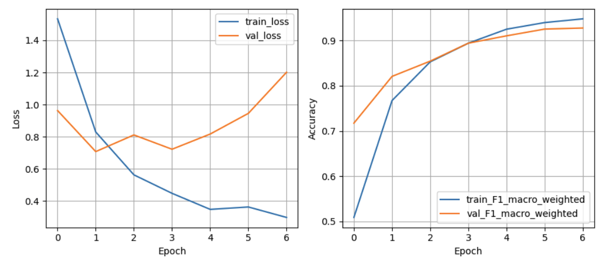

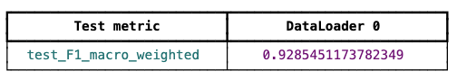

```python
# make predictions on test data and evaluate
preds_y_test = torch.cat(trainer.predict(model=lightningmodel, dataloaders=dm.test_dataloader()))
# inverse transform to get back to original labels
preds_y_test = dm.label_encoder_target.inverse_transform(preds_y_test.reshape(-1, 1))
y_test = dm.label_encoder_target.inverse_transform(dm.test_dataset.get_dataframe.iloc[:, -1].values.reshape(-1, 1))
# calculate classification report
print(classification_report(y_test, preds_y_test))
```

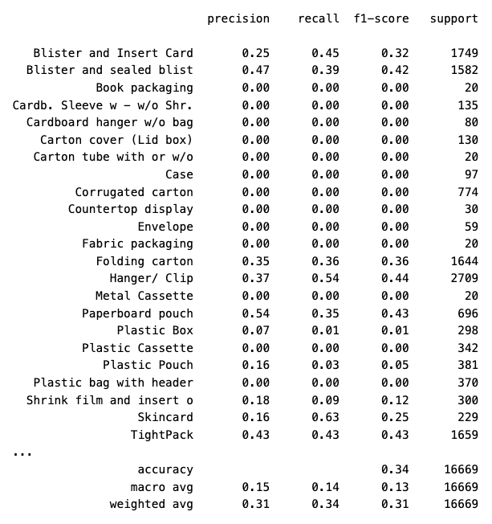
*MLP Classification Report*

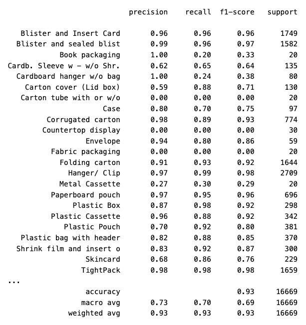
*embMLP Classification Report*

# 6. Summary

In this blog post, we explored a comprehensive framework for implementing deep learning models on tabular datasets, with a focus on multiclass classification. The key components we covered include:

1. **Lightning-based Training Pipeline**:
We discussed a PyTorch Lightning module (`MulticlassTabularLightningModule`) for training multiclass classification models. This module integrates standard components like training, validation, and testing loops, as well as metrics tracking (e.g., accuracy, F1 score). The model supports both continuous and categorical features, leveraging custom metrics for performance evaluation and logging with Lightning's built-in tools.
2. **Neural Network Architecture for Tabular Data**:
Several model architectures were introduced for handling tabular data, including:
    - A **vanilla MLP model** (`MulticlassTabularMLP`), which uses fully connected layers to perform classification tasks.
    - A more sophisticated **Embedding MLP model** (`MulticlassTabularCatEmbeddingMLP`), which incorporates embeddings for categorical variables, improving the model’s efficiency in handling high-cardinality categorical features by converting them into dense, continuous-valued vectors.
3. **In summary**, the code automates the training and optimization process of an MLP model, including hyperparameter tuning (learning rate), logging, early stopping, and performance evaluation on test data. It provides a robust framework for managing the entire lifecycle of a simple experiment.

This post equips readers with the knowledge to build and train effective deep learning models on tabular data, leveraging the flexibility of PyTorch Lightning and advanced techniques like embeddings for categorical features. These techniques enable efficient and scalable solutions for real-world multiclass classification tasks.

Related frameworks: [PyTorch Tabular](https://pytorch-tabular.readthedocs.io/en/latest/)
"PyTorch Tabular is a powerful library that aims to simplify and popularize the application of deep learning techniques to tabular data."
The library provieds a high-level API for deep learning on tabular data including data preprocessing, model training, and model evaluation. The downside is that the abstraction layer it provides does not allow for fine-grained control over the machine learning workflow.

# 7. Code structure

```
Directory-tree structure:  
|-- environment.yml  
|-- README.md  
|-- README_ml_packaging_classification.md  
|-- notebooks  
|   |-- 20_clf_pipeline_pytorch_embeddingMLP_optuna.ipynb # Embedding MLP with Optuna  
|   |-- 20_clf_pipeline_pytorch_embeddingMLP.ipynb # Embedding MLP  
|   |-- 20_clf_pipeline_pytorch_MLP_optuna.ipynb # MLP with Optuna  
|   |-- 20_clf_pipeline_pytorch_MLP.ipynb # MLP, including deteiled code description  
|-- src  
|   |-- pytorch_tabular # Modules for Tabular Data using PyTorch Lightning
|   |   |-- callbacks.py # callbacks for Lightning Trainer  
|   |   |-- enciders.py # custom encoders for data preprocessing  
|   |   |-- tabular_lightning.py # lightning classes for tabular data  
|   |   |-- tabular_lightning_utils.py # for shared utilitie functions  
|   |   |-- tabular_models.py # custom models for Pytorch/Lightning  
|   |-- utils.py # for shared functions  
```
